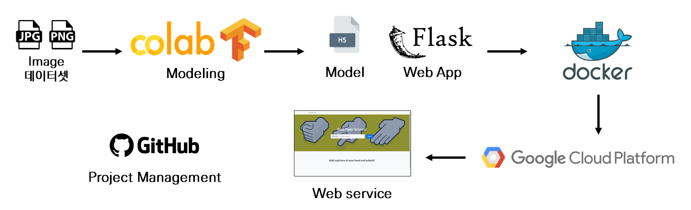

# 이미지 예측을 통한 가위바위보 게임 서비스

## [Demo](https://rps-project.run.goorm.io/)

## 프로젝트 흐름도

## 프로젝트 목표

인공지능 서비스 개발 및 ML 워크플로 이해  

## Tech Stack

1. 모델링
    - Python, Tensorflow

2. 웹 앱
    - Frontend – Bootstrap(HTML, CSS)
    - Backend - Flask
    - Server - GCP Compute Engine

3. Platform 
    - Docker

4. 기타
    - Github

## 데이터셋

- 가위,바위,보 이미지 각각 2,500개, 총 7,500개의 이미지 데이터
- 모델링 과정에서 오분류된 데이터 중 이상데이터 제거

## 모델링

하드웨어 사양
- Tesla K80 12GB, (Colab 환경, GPU)

데이터의 개수가 많지 않아 전이 학습을 진행  
MobileNet, Xception, ResNet50 모델을 비교
- Optimizer : Adam
- learning rate : 2e-5
- Epochs : 20
- Metrics : Cross entropy

|             | MobileNet |  Xception  |  ResNet50   |
|:-----------:|:---------:|:----------:|:-----------:|
|파라미터 개수 | 5,589,187 | 29,251,115 |31,977,347|
| 소요 시간(분:초)  |   6:17    |   11:23    | 9:01|
|   정확도(%)    |   99.3    |    99.5    | 99.7|

비교 결과 모두 3% 미만의 overfitting, 99% 이상의 정확도를 보여주며, 모델 간 0.5% 이하의 차이를 보여줌  
추후 CI/CD 적용을 고려하여 가장 가벼운 모델인 MobileNet 채택

## 웹앱

- HTML, CSS를 통해 웹 페이지 구현
- File 송수신을 통해 서버와 이미지를 주고 받음
- Flask를 통해 GCP 서버에서 웹 페이지 구동

## 기타
- Github를 통한 이슈 트래킹과 코드 형상관리
- Docker를 통한 Container 제공, 배포 관리 단순화

## 회고

- 비교적 간단한 분류 문제로서 MobileNet과 같이 복잡한 모델을 사용하지 않아도 충분히 성능을 낼 수 있을 것으로 예상, 더 작은 모델로 개선 가능
- 웹앱, 컨테이너, 인스턴스 간의 ip, 포트 연결 문제가 있어 로컬에서 단순 웹앱은 이상없었으나 도커컨테이너에선 접근이 불가능 했음 
  - 가상환경, ip binding, 포트포워딩에 대한 이해도 필요
- 사용성이 편리한 heroku를 사용하려고 했으나, 프로젝트에 필요한 모듈의 용량으로 인해 heroku 서버에 업로드가 불가능 했음 (Heroku 용량 제한 500MB)
  - 모듈간의 의존성의 이해와 최적화 필요

## 향후목표

- CNN을 통한 모델 개선
- 포트 포워딩 등 네트워크 이해를 통한 서버 안정화
- 모델 API 패키징
- CI/CD툴을 사용해 자동화,로깅,모니터링 추가
- K8S클러스터 구성 및 CT 파이프라인 구성
- 데이터 버전 관리
